<p align="center">
  
</p>

<p align="center">
  <a href="https://www.linkedin.com/in/guillermoarmoa"></a>
  <a href="mailto:armoa.guillermoj@gmail.com"></a>
  
</p>

### About

Biomedical engineer (PUCP, Lima) currently finishing my undergraduate thesis on **AI-assisted motion analysis**:
a markerless pipeline that detects lower-limb landing asymmetries in volleyball players, validated against
videogrammetry — that's the real data you're seeing in the banner above.

I work where **computer vision**, **biomechanics** and **deep learning** meet: pose estimation on video,
signal processing on wearables, and ML models on medical images. More than any single tool, what I enjoy
is learning — new methods, new domains, new problems.

- Research at **TeHealP** (Technology Applied to Health and Physical Performance, PUCP)
- Previously: research intern at **LIBRA** (Biomechanics & Applied Robotics Lab, PUCP), clinical engineering intern at Clínica Internacional

### Selected work

| Project | What it does | Status |
|---|---|---|
| **Landing asymmetry thesis** | Markerless pose pipeline (Sports2D vs Kinovea) → Winter residual filtering, joint angles, SPM1D / Bland-Altman / ICC / SI% | In progress |
| **Pediatric appendicitis CDSS** | Deep-learning ultrasound classifier + automated reporting for rural Andean settings | 🏆 IFMBE Student Project Contest winner (SABI 2025) · Springer IFMBE Proc. vol. 136 |
| **Parkinson's tremor & FOG** | iOS inertial sensing @50 Hz + Random Forest (90% FOG accuracy), spectral tremor analysis (4–6 Hz) | ICIIBMS 2025 |
| **Clinical sign-language interpreter** | MediaPipe Holistic landmarks + vision models + LLM semantic integration; 8.22 FPS on a laptop, single RGB camera | Poster, IEEE EMBC 2026 (Toronto) |
| **YOLO caries detection** | Multi-seed (15 seeds) YOLO11 vs YOLO26 benchmark on panoramic radiographs under limited GPU | Accepted, J. of AI in Dentistry |

### Toolbox

```text
Languages     Python · MATLAB · SQL · STATA · LaTeX
ML / DL       PyTorch · scikit-learn · CNNs & transfer learning · Random Forest
              LightGBM · XGBoost · LSTM · Optuna · RL · LLM integration
Vision        MediaPipe Holistic · OpenPose · Sports2D · YOLO · BiomedCLIP · OpenCV
Signals       EEG (alpha/beta) · IMU accelerometer/gyroscope · spectral methods
              Winter residual analysis · MNE
Data          NumPy · Pandas · Matplotlib · Seaborn · Power BI · Excel
CAD           Fusion 360 · Inventor · Onshape
Hardware      OpenBCI · Ultracortex Mark IV · Kinovea
```

<p align="center">
  <i>Off-screen: I play for the PUCP men's volleyball team — the same sport my thesis is about.</i>
</p>
